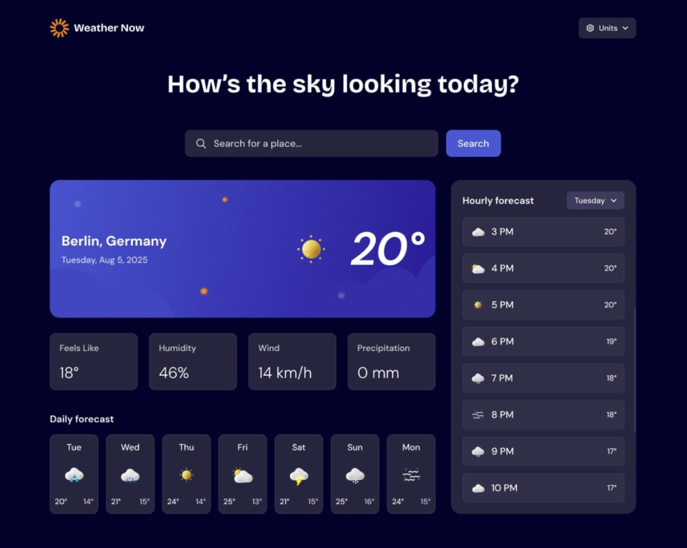

# 🌦️ Weather App

A modern weather application built with React that provides real-time weather data for any city using the Open-Meteo API.

This project was created to practice frontend architecture, API integration, state management, asynchronous requests, and responsive UI development using modern React concepts.

## 🚀 Live Demo

👉 https://weather-app-hazel-theta-69.vercel.app/

## 📸 Preview



## 📚 About The Project

This application allows users to search for real-time weather information from cities around the world.

The main goal of the project was to simulate a more realistic frontend architecture using reusable components, API abstraction, loading states, error handling, and responsive design principles.

This project was developed as part of my frontend learning journey while studying React and modern JavaScript.

## 🎨 Frontend Mentor Challenge

This project is based on a Frontend Mentor challenge.

The `design/` folder is included in the repository because it contains the original challenge assets and reference layouts provided by Frontend Mentor.

If you want to practice the same challenge yourself, you can use those files as a guide to recreate the project and compare different implementations.

## ✨ Features

* 🔍 Search weather by city name
* 🌡️ Display current weather conditions
* 🌥️ Dynamic weather information
* ⏳ Loading state during API requests
* ⚠️ Error handling for invalid searches
* 📱 Fully responsive layout
* 🧩 Reusable React components
* 🔄 Real-time API integration

## 🛠️ Tech Stack

### Frontend

* React
* Vite
* JavaScript (ES6+)
* CSS3

### APIs

* Open-Meteo API
* Geocoding API

## 🧠 Concepts Practiced

During this project, I practiced:

* React component architecture
* State management with hooks
* API consumption with async/await
* Error and loading handling
* Conditional rendering
* Responsive design
* Separation of responsibilities
* Reusable components
* Service layer abstraction
* Frontend project organization
* Deployment with Vercel

## 📂 Project Structure

```bash
src/
├── assets/
├── components/
├── context/
├── hooks/
├── pages/
├── services/
├── App.jsx
└── main.jsx
```

### Structure Explanation

* `components/` → reusable UI components
* `pages/` → page-level components
* `services/` → API request abstraction
* `hooks/` → custom React hooks
* `context/` → global state management
* `assets/` → static files and images

## ⚙️ Getting Started

Clone the repository:

```bash
git clone https://github.com/Richard-coding/weather-app
```

Enter the project folder:

```bash
cd weather-app
```

Install dependencies:

```bash
npm install
```

Run the development server:

```bash
npm run dev
```

The application will be available at:

```bash
http://localhost:5173
```

## 🏗️ Production Build

Generate the production build:

```bash
npm run build
```

Preview the production version locally:

```bash
npm run preview
```

## 🌍 API Workflow

1. User searches for a city
2. The geocoding API retrieves city coordinates
3. Weather API fetches real-time weather data
4. The interface updates dynamically with the received data

## 🎯 Challenges Faced

Some challenges during development included:

* Managing asynchronous requests
* Handling loading and error states
* Organizing project structure
* Keeping components reusable and scalable
* Improving responsiveness across devices

## 👨‍💻 Author

Richard

Frontend Developer Student focused on React and modern web development.

* GitHub: https://github.com/Richard-coding
* LinkedIn: (add your LinkedIn here)
